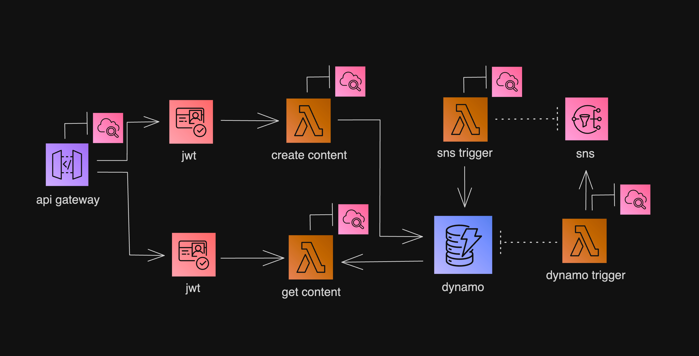

# Proyecto Terraform con AWS Lambda, DynamoDB, SNS, API Gateway y Cognito


## Arquitectura

El proyecto sigue la siguiente arquitectura:

- **API Gateway**: Gestiona las solicitudes HTTP y las redirige a las funciones Lambda.
- **AWS Lambda**: Contiene funciones para crear y obtener contenido.
- **DynamoDB**: Base de datos NoSQL utilizada para almacenar los datos.
- **SNS (Simple Notification Service)**: Sistema de notificaciones para eventos de la base de datos.
- **Cognito**: Servicio de autenticación para gestionar usuarios.

## Recursos Implementados con Terraform

El proyecto define los siguientes módulos en Terraform:

- **DynamoDB**: Una tabla para almacenar contactos con un stream habilitado.
- **API Gateway**: Configurado con rutas para la creación y recuperación de contactos.
- **Lambda Functions**:
  - `create_contact`: Inserta un nuevo contacto en DynamoDB.
  - `get_contact`: Recupera un contacto por ID desde DynamoDB.
  - `dynamodb_trigger`: Procesa eventos del stream de DynamoDB y publica en SNS.
  - `sns_trigger`: Escucha eventos de SNS y actualiza DynamoDB.
- **SNS Topic**: Para recibir eventos de actualizaciones de DynamoDB.
- **Cognito User Pool**: Para autenticación mediante JWT.

## Despliegue

1. Clonar el repositorio.
2. Modificar las variables en `terraform.tfvars`.
3. Ejecutar los siguientes comandos:
   ```sh
   terraform init -var-file="env/dev/ar.tfvars"
   terraform plan -var-file="env/dev/ar.tfvars"
   terraform apply -auto-approve -var-file="env/dev/ar.tfvars"
   ```
4. Para eliminar la infraestructura:
   ```sh
   terraform destroy -auto-approve -var-file="env/dev/ar.tfvars"
   ```